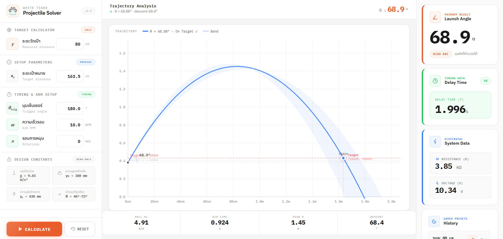
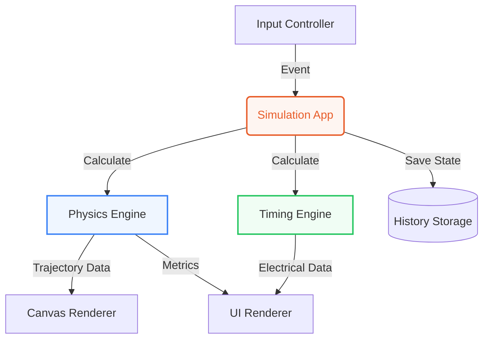

<div align="center">
  

  # 🐾 WHITE TIGER · Projectile Solver
  
  **Interactive Projectile Trajectory Calculator & Physics Simulation** <br>
  *Clean UI • Real-time Canvas Graph • Engineering Grade*
  
  
  
  
  

</div>

<br>

<!-- 🚨 แนบรูปภาพตัวอย่าง UI ตรงนี้ 🚨 -->


---

## 🎯 รายละเอียดโปรเจกต์ (Description)

**WHITE TIGER Projectile Calculator** เป็นเว็บแอปพลิเคชันหน้าตาทันสมัยระดับมืออาชีพ ที่ออกแบบมาเพื่อช่วยวิศวกรและนักพัฒนาในการคำนวณพารามิเตอร์ของ **เครื่องยิงกระสุน (Projectile Launcher)** 

### ✨ จุดเด่น (Key Features)

*   📐 **Launch Angle Solver**: หาระยะมุมยิงแบบ (High Arc) อัตโนมัติจากสมการ Quadratic ภายในช่วง 46°–73°
*   📈 **Real-time Trajectory Graph**: พล็อตกราฟวิถีกระสุนสดๆ บน HTML5 Canvas พร้อม **Trajectory Band** (แถบสีฟ้าแสดงระยะเผื่อการกระจาย)
*   ⏱️ **Timing & Arm Setup**: คำนวณเวลาหน่วง (Delay Time) สัมพันธ์กับรอบมอเตอร์ (RPM)
*   ⚡ **Electrical Data**: คำนวณค่า R (Resistance) และ V (Voltage) ให้พร้อมใช้งานสำหรับวงจร
*   💾 **Preset History**: ระบบบันทึกประวัติการคำนวณ (ใช้ LocalStorage)
*   🔄 **Dirty Tracking UI**: ตรวจจับและแจ้งเตือนทันทีเมื่อค่า Input เปลี่ยนแปลง (ปุ่ม Calculate กระพริบเตือน)

---

## 🚀 เริ่มต้นใช้งาน (Quick Start)

โปรเจกต์นี้ทำงานด้วย **Vanilla JS (No Framework)** ไม่จำเป็นต้องลง npm หรือ build tool ใดๆ ทั้งสิ้น:

1. โคลนโปรเจกต์นี้ หรือดาวน์โหลดเป็นไฟล์ ZIP
   ```bash
   git clone https://github.com/guynattakorn/white_tiger.git
   ```
2. ดับเบิลคลิกเปิดไฟล์ `index.html` บนเบราว์เซอร์ (แนะนำ Chrome, Edge หรือ Safari รุ่นล่าสุด)
3. หรือใช้ **Live Server** Extension บน VS Code เพื่อประสบการณ์ที่ดีที่สุด

---

## 🏗️ สถาปัตยกรรม (Architecture Flow)

การเขียนโค้ดถูกออกแบบภายใต้หลักการ Clean OOP แยกโมดูลกันอย่างชัดเจนตามไดอะแกรมด้านล่างนี้:



---

## 🔧 พารามิเตอร์ระบบ (Constants)

| ตัวแปร (Variable) | ค่าที่ตั้งไว้ | คำอธิบาย |
| :--- | :---: | :--- |
| **Gravity (`g`)** | `9.81 m/s²` | ค่าแรงโน้มถ่วงมาตรฐาน |
| **Launch Height (`y₀`)** | `380 mm` | จุดปล่อยลูกกระสุนจากพื้น |
| **Target Height (`yₜ`)** | `430 mm` | ตำแหน่งรับกระสุนเป้าหมาย |
| **Angle Range (`θ`)** | `46°–73°` | ขอบเขตมุมที่อนุญาตให้ยิงได้ |

---

<div align="center">
  <br>
  <i>Developed with ❤️, Antigravity, and Claude Code for the White Tiger Project</i>
</div>
